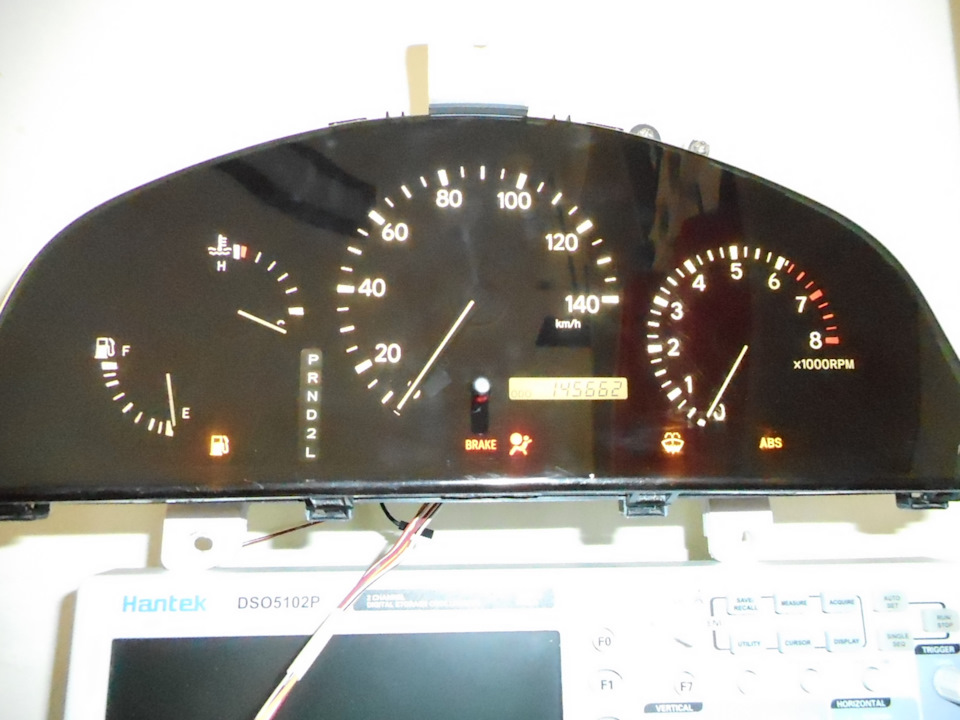
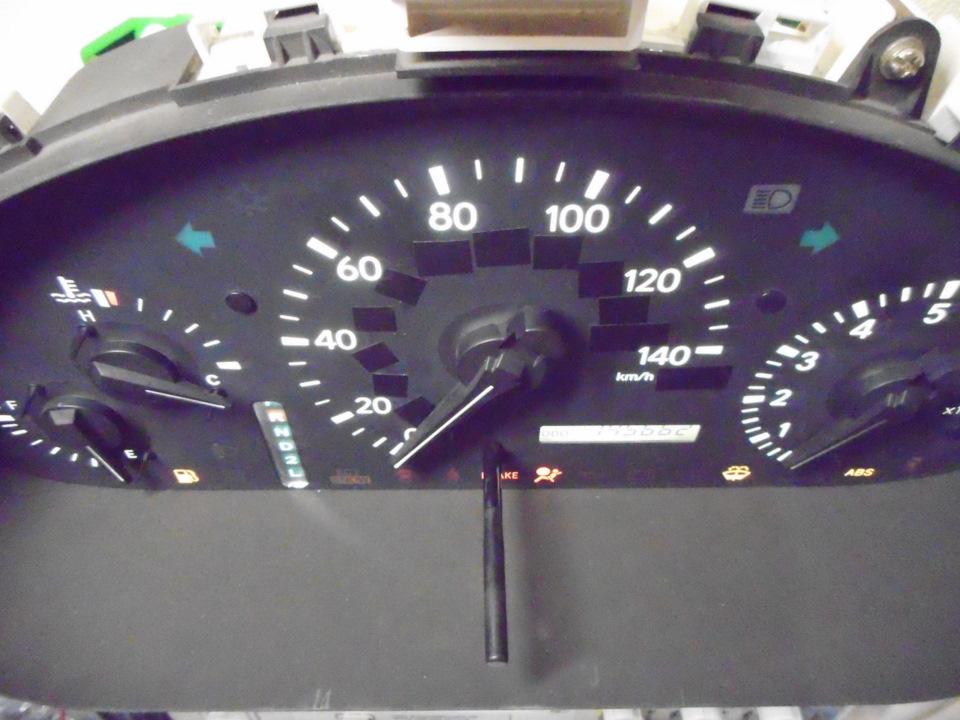
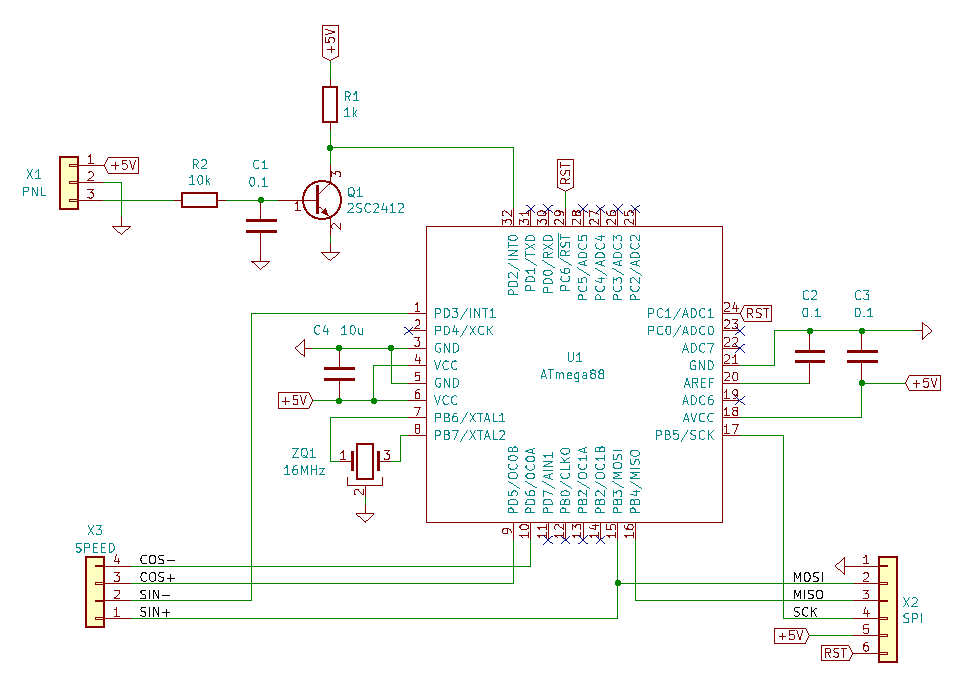
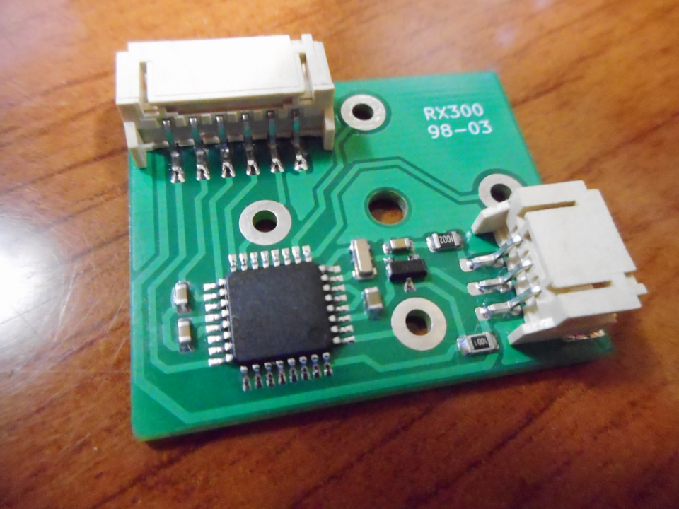
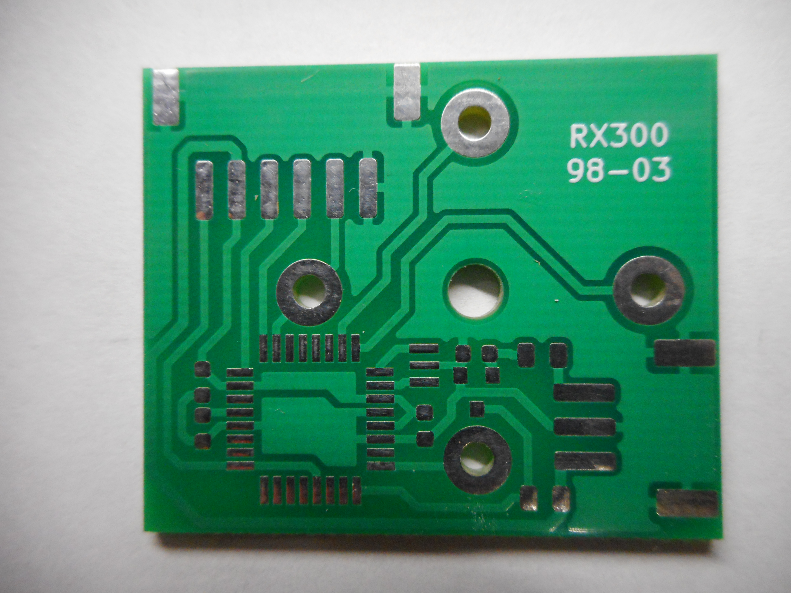

# Модуль перевода показаний спидометра Lexus RX300 в километры в час #

Владельцы Lexus RX300 американского производства знают, что спидометр данного авто имеет две шкалы - крупную в милях в час и мелкую - в км/ч. В связи с этим считывание показаний спидометра в нужных нам единицах несколько затруднено. Предлагаемое устройство призвано решить эту проблему путем "переноса" действительных показаний спидометра в км/ч с мелкой шкалы на крупную.

Устройство подходит для приборных панелей Lexus RX300 1-го поколения (1998...2003).

  

  

  

Больше информации и инструкция по установке здесь: https://www.drive2.ru/l/583354966161298745/

## Готовый модуль ##

Для желающих получить результат быстрее в продаже есть готовые модули:
https://baza.drom.ru/krasnodar/sell_spare_parts/nabor-dlja-perevoda-pokazanij-spidometra-lexus-rx300-v-kilometry-v-chas-99117473.html

  

## Готовая печатная плата ##

Также в продаже имеются печатные платы модуля: https://baza.drom.ru/krasnodar/sell_spare_parts/pechatnaja-plata-dlja-modulja-spidometra-lexus-rx300-99118293.html

  

